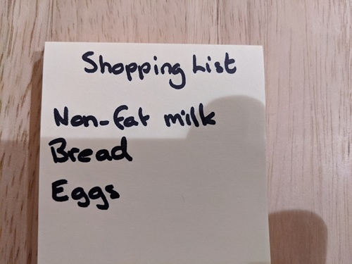

---
lab:
  title: Lectura de texto de las imágenes
  description: Use el reconocimiento óptico de caracteres (OCR) del servicio Análisis de imágenes de Visión de Azure AI para buscar y extraer el texto de las imágenes.
---

# Lectura de texto de las imágenes

El reconocimiento óptico de caracteres (OCR) es un subconjunto de Computer Vision que se ocupa de leer texto en imágenes y documentos. El servicio Análisis de imágenes de **Visión de Azure AI** proporciona una API para leer texto, que explorará en este ejercicio.

> **Nota**: Este ejercicio se basa en software de SDK de la versión preliminar, que podrían cambiar. Cuando ha sido necesario, hemos usado versiones específicas de paquetes; que pueden no ser las versiones disponibles más recientes. Puede que se produzcan algunos errores, comportamientos o advertencias inesperados.

Aunque este ejercicio se basa en el SDK de Python de Azure Vision Analysis, puede desarrollar aplicaciones de visión mediante varios SDK específicos del lenguaje, como:

* [Azure AI Vision Analysis para JavaScript](https://www.npmjs.com/package/@azure-rest/ai-vision-image-analysis)
* [Azure AI Vision Analysis para Microsoft .NET](https://www.nuget.org/packages/Azure.AI.Vision.ImageAnalysis)
* [Azure AI Vision Analysis para Java](https://mvnrepository.com/artifact/com.azure/azure-ai-vision-imageanalysis)

Este ejercicio dura aproximadamente **30** minutos.

## Aprovisionar un recurso de Visión de Azure AI

Si aún no tiene uno en la suscripción, deberá aprovisionar un recurso de Visión de Azure AI.

> **Nota**: En este ejercicio, usará un recurso de **Computer Vision** independiente. También puede usar los servicios de Visión de Azure AI en un recurso de varios servicios de los *servicios de Azure AI*, ya sea directamente o en un proyecto de *Fundición de IA de Azure*.

1. Abra [Azure Portal](https://portal.azure.com) en `https://portal.azure.com`, e inicie sesión con sus credenciales de Azure. Cierre los mensajes de bienvenida o sugerencias que se muestran.
1. Seleccione **Crear un recurso**.
1. En la barra de búsqueda, busque `Computer Vision`, seleccione **Computer Vision** y cree el recurso con la siguiente configuración:
    - **Suscripción**: *suscripción a Azure*
    - **Grupo de recursos**: *crea o selecciona un grupo de recursos*
    - **Región**: *Seleccione entre **Este de EE. UU.**, **Oeste de EE. UU.**, **Centro de Francia**, **Centro de Corea del Sur**, **Norte de Europa**, **Sudeste Asiático**, **Oeste de Europa** o **Este de Asia**\**
    - **Nombre**: *Un nombre válido para el recurso de Computer Vision*
    - **Plan de tarifa**: F0 gratis.

    \*Los conjuntos de características completas de Visión de Azure AI 4.0 solo están disponibles actualmente en estas regiones.

1. Active las casillas necesarias y cree el recurso.
1. Espere a que se complete la implementación y, a continuación, vea los detalles de la implementación.
1. Cuando se haya implementado el recurso, vaya a él y, en el nodo **Administración de recursos** del panel de navegación, vea su página **Claves y punto de conexión**. Necesitará el punto de conexión y una de las claves de esta página en el procedimiento siguiente.

## Desarrollo de una aplicación de extracción de texto con el SDK de Visión de Azure AI

En este ejercicio, realizará una aplicación cliente parcialmente implementada que usa el SDK de Visión de Azure AI para extraer texto de las imágenes.

### Preparación de la configuración de aplicación

1. En Azure Portal, use el botón **[\>_]** situado a la derecha de la barra de búsqueda en la parte superior de la página para crear una nueva instancia de Cloud Shell en Azure Portal, y seleccione un entorno de ***PowerShell*** sin almacenamiento en su suscripción.

    Cloud Shell proporciona una interfaz de la línea de comandos en un panel situado en la parte inferior de Azure Portal.

    > **Nota**: si has creado anteriormente una instancia de Cloud Shell que usa un entorno de *Bash*, cámbiala a ***PowerShell***.

    > **Nota**: Si el portal le pide que seleccione un almacenamiento para conservar los archivos, elija **No se requiere una cuenta de almacenamiento**, seleccione la suscripción que usa y presione **Aplicar**.

1. En la barra de herramientas de Cloud Shell, en el menú **Configuración**, selecciona **Ir a la versión clásica** (esto es necesario para usar el editor de código).

    **<font color="red">Asegúrate de que has cambiado a la versión clásica de Cloud Shell antes de continuar.</font>**

1. Cambie el tamaño del panel de Cloud Shell para que pueda ver la página **Claves y punto de conexión** del recurso de Computer Vision.

    > **Sugerencia**: Puede cambiar el tamaño del panel arrastrando el borde superior. También puede usar los botones de minimizar y maximizar para cambiar entre Cloud Shell y la interfaz principal del portal.

1. En el panel de Cloud Shell, escribe los siguientes comandos para clonar el repositorio de GitHub que contiene los archivos de código de este ejercicio (escribe el comando o cópialo en el Portapapeles y, a continuación, haz clic con el botón derecho en la línea de comandos y pega como texto sin formato):

    ```
    rm -r mslearn-ai-vision -f
    git clone https://github.com/MicrosoftLearning/mslearn-ai-vision
    ```

    > **Sugerencia**: al pegar comandos en CloudShell, la salida puede ocupar una gran cantidad del búfer de pantalla. Puedes despejar la pantalla al escribir el comando `cls` para que te resulte más fácil centrarte en cada tarea.

1. Una vez clonado el repositorio, use el siguiente comando para ir a los archivos de código de la aplicación:

    ```
   cd mslearn-ai-vision/Labfiles/ocr/python/read-text
   ls -a -l
    ```

    La carpeta contiene archivos de código y configuración de aplicaciones para la aplicación. También contiene una subcarpeta **/images**, con algunos archivos de imagen para que la aplicación los analice.

1. Instale el paquete del SDK de Visión de Azure AI y otros paquetes necesarios ejecutando los siguientes comandos:

    ```
   python -m venv labenv
   ./labenv/bin/Activate.ps1
   pip install -r requirements.txt azure-ai-vision-imageanalysis==1.0.0
    ```

1. Escriba el siguiente comando para editar el archivo de configuración de la aplicación:

    ```
   code .env
    ```

    El archivo se abre en un editor de código.

1. En el archivo de código, actualice los valores de configuración que contiene para reflejar el **punto de conexión** y una **clave** de autenticación para el recurso de Computer Vision (copiado de su página **Claves y punto de conexión** de Azure Portal).
1. Después de reemplazar los marcadores de posición, usa el comando **CTRL+S** para guardar los cambios y, a continuación, usa el comando **CTRL+Q** para cerrar el editor de código mientras mantienes abierta la línea de comandos de Cloud Shell.

### Adición de código para leer el texto de una imagen

1. En la línea de comandos de Cloud Shell, escriba el siguiente comando para abrir el archivo de código de la aplicación cliente:

    ```
   code read-text.py
    ```

    > **Sugerencia**: Es posible que quiera maximizar el panel de Cloud Shell y mover la barra de división entre la consola de la línea de comandos y el editor de código para ver mejor el código.

1. En el archivo de código, busque el comentario **Importar espacios de nombres** y agregue el código siguiente para importar los espacios de nombres que deberá usar el SDK de Visión de Azure AI:

    ```python
   # import namespaces
   from azure.ai.vision.imageanalysis import ImageAnalysisClient
   from azure.ai.vision.imageanalysis.models import VisualFeatures
   from azure.core.credentials import AzureKeyCredential
    ```

1. En la función **Main**, se ha proporcionado el código para cargar los valores de configuración y determinar el archivo que se va a analizar. A continuación, busque el comentario **Autenticar el cliente de Visión de Azure AI** y agregue el siguiente código específico del lenguaje para crear y autenticar un objeto cliente de Análisis de imágenes de Visión de Azure AI:

    ```python
   # Authenticate Azure AI Vision client
   cv_client = ImageAnalysisClient(
        endpoint=ai_endpoint,
        credential=AzureKeyCredential(ai_key))
    ```

1. En la función **Main**, en el código que acaba de agregar, busque el comentario **Leer el texto de la imagen** y agregue el código siguiente para usar el cliente de análisis de imágenes para leer el texto de la imagen:

    ```python
   # Read text in image
   with open(image_file, "rb") as f:
        image_data = f.read()
   print (f"\nReading text in {image_file}")

   result = cv_client.analyze(
        image_data=image_data,
        visual_features=[VisualFeatures.READ])
    ```

1. Busque el comentario **Imprimir el texto** y agregue el código siguiente (incluido el comentario final) para imprimir las líneas de texto que se encontraron y llamar a una función para anotarlas en la imagen (con el elemento **bounding_polygon** devuelto para cada línea de texto):

    ```python
   # Print the text
   if result.read is not None:
        print("\nText:")
    
        for line in result.read.blocks[0].lines:
            print(f" {line.text}")        
        # Annotate the text in the image
        annotate_lines(image_file, result.read)

        # Find individual words in each line
        
    ```

1. Guarde los cambios (*CTRL+S*), pero mantenga abierto el editor de código por si tiene que corregir los errores tipográficos.

1. Cambie el tamaño de los paneles para que pueda ver más de la consola y, a continuación, escriba el siguiente comando para ejecutar el programa:

    ```
   python read-text.py images/Lincoln.jpg
    ```

1. El programa lee el texto del archivo de imagen especificado (*images/Lincoln.jpg*), que tiene este aspecto:

    

1. En la carpeta **read-text**, se ha creado una imagen **lines.jpg**. Use el comando **download** (específico de Azure Cloud Shell) para descargarlo:

    ```
   download lines.jpg
    ```

    El comando download crea un vínculo emergente en la parte inferior derecha del explorador, que puedes seleccionar para descargar y abrir el archivo. La imagen debe tener un aspecto similar al siguiente:

    

1. Vuelva a ejecutar el programa, pero esta vez especificando los parámetros *images/Business-card.jpg* para extraer el texto de la imagen siguiente:

    

    ```
   python read-text.py images/Business-card.jpg
    ```

1. Descargue y vea el archivo **lines.jpg** resultante:

    ```
   download lines.jpg
    ```

1. Ejecute el programa una vez más, pero esta vez especificando el parámetro *images/Note.jpg* para extraer el texto de esta imagen:

    

    ```
   python read-text.py images/Note.jpg
    ```

1. Descargue y vea el archivo **lines.jpg** resultante:

    ```
   download lines.jpg
    ```

### Adición de código para devolver la posición de palabras individuales

1. Cambie el tamaño de los paneles para que pueda ver más del archivo de código. A continuación, busque el comentario **Buscar palabras individuales en cada línea** y agregue el código siguiente (teniendo cuidado de mantener el nivel de sangría correcto):

    ```python
   # Find individual words in each line
   print ("\nIndividual words:")
   for line in result.read.blocks[0].lines:
        for word in line.words:
            print(f"  {word.text} (Confidence: {word.confidence:.2f}%)")
   # Annotate the words in the image
   annotate_words(image_file, result.read)
    ```

1. Guarde los cambios (*CTRL+S*). A continuación, en el panel de línea de comandos, vuelva a ejecutar el programa para extraer el texto de *images/Lincoln.jpg*.
1. Observe la salida; debería incluir cada palabra individual de la imagen y la confianza asociada a su predicción.
1. En la carpeta **read-text**, se ha creado una imagen **words.jpg**. Use el comando **download** (específico de Azure Cloud Shell) para descargarla y verla:

    ```
   download words.jpg
    ```

1. Vuelva a ejecutar el programa para *images/Business-card.jpg* y *images/Note.jpg* y verá el archivo **words.jpg** generado para cada imagen.

## Limpieza de recursos

Si ha terminado de explorar Visión de Azure AI, debe eliminar los recursos que ha creado en este ejercicio para evitar incurrir en costes innecesarios de Azure:

1. Inicie sesión en Azure Portal en `https://portal.azure.com` y regístrese con la cuenta de Microsoft asociada a su suscripción de Azure.

1. En la barra de búsqueda superior, busque *Computer Vision* y seleccione el recurso de Computer Vision que creó en este laboratorio.

1. En la página del recurso, seleccione **Eliminar** y siga las instrucciones para eliminar el recurso.
