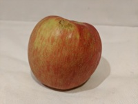

---
lab:
  title: Clasificación de imágenes
  description: Use el servicio Custom Vision de Azure AI para entrenar un modelo de clasificación de imágenes.
---

# Clasificación de imágenes

El servicio **Custom Vision de Azure AI** le permite crear modelos de visión del equipo que están entrenados con sus propias imágenes. Puede usarlo para entrenar modelos de *clasificación de imágenes* y *detección de objetos*, que más tarde puede publicar y consumir desde las aplicaciones.

En este ejercicio, usará el servicio Custom Vision para entrenar un modelo de clasificación de imágenes que pueda identificar tres tipos de fruta (manzana, plátano y naranja).

Aunque este ejercicio se basa en el SDK de Python de Azure Custom Vision, puede desarrollar aplicaciones similares usando varios SDK específicos del lenguaje, como:

* [Azure Custom Vision para JavaScript (entrenamiento)](https://www.npmjs.com/package/@azure/cognitiveservices-customvision-training)
* [Azure Custom Vision para JavaScript (predicción)](https://www.npmjs.com/package/@azure/cognitiveservices-customvision-prediction)
* [Azure Custom Vision para Microsoft .NET (entrenamiento)](https://www.nuget.org/packages/Microsoft.Azure.CognitiveServices.Vision.CustomVision.Training/)
* [Azure Custom Vision para Microsoft .NET (predicción)](https://www.nuget.org/packages/Microsoft.Azure.CognitiveServices.Vision.CustomVision.Prediction/)
* [Azure Custom Vision para Java (entrenamiento)](https://search.maven.org/artifact/com.azure/azure-cognitiveservices-customvision-training/1.1.0-preview.2/jar)
* [Azure Custom Vision para Java (predicción)](https://search.maven.org/artifact/com.azure/azure-cognitiveservices-customvision-prediction/1.1.0-preview.2/jar)

Este ejercicio dura aproximadamente **45** minutos.

## Creación de recursos de Custom Vision

Antes de poder entrenar un modelo, necesitará recursos de Azure para el *entrenamiento* y la *predicción*. Puede crear recursos de **Custom Vision** para cada una de estas tareas, o puede crear un único recurso y usarlo en ambas. En este ejercicio, creará recursos de **Custom Vision** para entrenamiento y predicción.

1. Abra [Azure Portal](https://portal.azure.com) en `https://portal.azure.com`, e inicie sesión con sus credenciales de Azure. Cierre los mensajes de bienvenida o sugerencias que se muestran.
1. Seleccione **Crear un recurso**.
1. En la barra de búsqueda, busque `Custom Vision`, seleccione **Custom Vision** y cree el recurso con la siguiente configuración:
    - **Opciones de creación**: ambas
    - **Suscripción**: *suscripción a Azure*
    - **Grupo de recursos**: *crea o selecciona un grupo de recursos*
    - **Región**: *elige cualquier región disponible*
    - **Nombre**: *un nombre válido para el recurso de Custom Vision*.
    - **Plan de tarifa de entrenamiento**: F0
    - **Plan de tarifa de predicción**: F0

1. Cree el recurso y espere a que se finalice la implementación; a continuación, vea los detalles de la implementación. Tenga en cuenta que se aprovisionan dos recursos de Custom Vision; uno para entrenamiento y otro para predicción.

    > **Nota**: Cada recurso tiene su propio *punto de conexión* y sus *claves*, que se usan para administrar el acceso desde el código. Para entrenar un modelo de clasificación de imágenes, el código debe usar el recurso de *entrenamiento* (con su punto de conexión y su clave); y para usar el modelo entrenado para predecir clases de imágenes, el código debe usar el recurso de *predicción* (con su punto de conexión y su clave).

1. Cuando se hayan implementado los recursos, vaya al grupo de recursos para verlos. Debería ver dos recursos de Custom Vision, uno con el sufijo ***-Prediction***.

## Creación de un proyecto de Custom Vision en el portal de Custom Vision

Para entrenar un modelo de clasificación de imágenes, debe crear un proyecto de Custom Vision basado en su recurso de entrenamiento. Para hacerlo, debe usar el portal de Custom Vision.

1. Abra una nueva pestaña del explorador (manteniendo abierta la pestaña de Azure Portal; volverá a ella más adelante).
1. En la nueva pestaña del explorador, abra el [portal de Custom Vision](https://customvision.ai) en `https://customvision.ai`. Si se le solicita, inicie sesión con sus credenciales de Azure y acepte los términos de servicio.
1. En el portal de Custom Vision, cree un nuevo proyecto con la siguiente configuración:
    - **Nombre**: `Classify Fruit`
    - **Descripción**: `Image classification for fruit`
    - **Recurso**: *su recurso de Custom Vision*.
    - **Tipos de proyecto**: Clasificación
    - **Tipos de clasificación**: multiclase (etiqueta única por imagen)
    - **Dominios**: comida

### Carga y etiquetado de imágenes

1. En una nueva pestaña del explorador, descargue las [imágenes de entrenamiento](https://github.com/MicrosoftLearning/mslearn-ai-vision/raw/main/Labfiles/image-classification/training-images.zip) de `https://github.com/MicrosoftLearning/mslearn-ai-vision/raw/main/Labfiles/image-classification/training-images.zip` y extraiga la carpeta comprimida para ver su contenido. Esta carpeta contiene subcarpetas de imágenes de manzana, plátano y naranja.
1. En el portal de Custom Vision, en el proyecto de clasificación de imágenes, haga clic en **Agregar imágenes** y seleccione todos los archivos de la carpeta **training-images/apple** que descargó y extrajo anteriormente. A continuación, cargue los archivos de imagen, especificando la etiqueta `apple`, como aquí:

    

1. Use el icono de la barra de herramientas **Agregar imágenes** (**[+]**) para repetir el paso anterior para cargar las imágenes en la carpeta **banana** con la etiqueta y las imágenes de la carpeta naranja con la etiqueta `banana`. y las imágenes de la carpeta **orange** con la etiqueta `orange`.
1. Explore las imágenes cargadas en el proyecto de Custom Vision, debería tener 15 imágenes de cada clase, como en este ejemplo:

    

### Entrenamiento de un modelo

1. En el proyecto de Custom Vision, encima de las imágenes, haga clic en **Entrenar** (&#9881;<sub>&#9881;</sub>) para entrenar un modelo de clasificación usando las imágenes etiquetadas. Seleccione la opción **Quick Training** y, después, espere a que se complete el entrenamiento (puede tardar alrededor de un minuto).
1. Una vez entrenado el modelo, compruebe las métricas de rendimiento *Precision*, *Recall* y *AP* (miden la precisión de la predicción del modelo de clasificación y sus valores deberían ser altos).

    

> **Nota**: Las métricas de rendimiento se basan en un umbral de probabilidad del 50 % para cada predicción (es decir, si el modelo calcula una probabilidad del 50 % o superior de que una imagen sea de una clase determinada, se predice esa clase). Puede ajustar esta opción en la parte superior izquierda de la página.

### Prueba del modelo

1. Sobre las métricas de rendimiento, haga clic en **Quick Test**.
1. En el cuadro **Dirección URL de imagen**, escriba `https://aka.ms/test-apple` y haga clic en el botón *imagen de prueba rápida (&#10132;)* .
1. Consulte las predicciones obtenidas del modelo, la puntuación de probabilidad de *apple* debería ser la más alta, como en este ejemplo:

    

1. Pruebe con las imágenes siguientes:
    - `https://aka.ms/test-banana`
    - `https://aka.ms/test-orange`

1. Cierre la ventana **Quick Test**.

### Vea la configuración del proyecto

Al proyecto que ha creado se le ha asignado un identificador único, que deberá especificar en cualquier código que interactúe con él.

1. Haga clic en el icono *Configuración* (⚙) en la esquina superior derecha de la página **Rendimiento** para ver la configuración del proyecto.
1. En **General** (a la izquierda), anote el **identificador de proyecto** que identifica de forma única este proyecto.
1. A la derecha, en **Recursos**, observe que se muestran la clave y el punto de conexión. Estos son los detalles del recurso de *entrenamiento*. También puede obtener esta información viendo el recurso en Azure Portal.

## Uso de la API de *entrenamiento*

El portal de Custom Vision proporciona una cómoda interfaz de usuario que puede usar para cargar y etiquetar imágenes, y entrenar modelos. Sin embargo, en algunos escenarios puede que desee automatizar el entrenamiento de modelos mediante la API de entrenamiento de Custom Vision.

### Preparación de la configuración de aplicación

1. Vuelva a la pestaña del explorador que contiene Azure Portal (manteniendo abierta la pestaña del portal de Custom Vision; volverá a ella más adelante).
1. En Azure Portal, use el botón **[\>_]** situado a la derecha de la barra de búsqueda en la parte superior de la página para crear una nueva instancia de Cloud Shell en Azure Portal, y seleccione un entorno de ***PowerShell*** sin almacenamiento en su suscripción.

    Cloud Shell proporciona una interfaz de la línea de comandos en un panel situado en la parte inferior de Azure Portal.

    > **Nota**: si has creado anteriormente una instancia de Cloud Shell que usa un entorno de *Bash*, cámbiala a ***PowerShell***.

    > **Nota**: Si el portal le pide que seleccione un almacenamiento para conservar los archivos, elija **No se requiere una cuenta de almacenamiento**, seleccione la suscripción que usa y presione **Aplicar**.

1. En la barra de herramientas de Cloud Shell, en el menú **Configuración**, selecciona **Ir a la versión clásica** (esto es necesario para usar el editor de código).

    **<font color="red">Asegúrate de que has cambiado a la versión clásica de Cloud Shell antes de continuar.</font>**

1. Cambie el tamaño del panel de Cloud Shell para que pueda ver una mayor superficie.

    > **Sugerencia**: Puede cambiar el tamaño del panel arrastrando el borde superior. También puede usar los botones de minimizar y maximizar para cambiar entre Cloud Shell y la interfaz principal del portal.

1. En el panel de Cloud Shell, escribe los siguientes comandos para clonar el repositorio de GitHub que contiene los archivos de código de este ejercicio (escribe el comando o cópialo en el Portapapeles y, a continuación, haz clic con el botón derecho en la línea de comandos y pega como texto sin formato):

    ```
    rm -r mslearn-ai-vision -f
    git clone https://github.com/MicrosoftLearning/mslearn-ai-vision
    ```

    > **Sugerencia**: al pegar comandos en CloudShell, la salida puede ocupar una gran cantidad del búfer de pantalla. Puedes despejar la pantalla al escribir el comando `cls` para que te resulte más fácil centrarte en cada tarea.

1. Una vez clonado el repositorio, use el siguiente comando para ir a los archivos de código de la aplicación:

    ```
   cd mslearn-ai-vision/Labfiles/image-classification/python/train-classifier
   ls -a -l
    ```

    La carpeta contiene archivos de código y configuración de aplicaciones para la aplicación. También contiene una subcarpeta **/more-training-images**, que contiene algunos archivos de imagen que usará para realizar entrenamiento adicional del modelo.

1. Instale el paquete del SDK de Custom Vision de Azure AI para entrenamiento y cualquier otro paquete necesario ejecutando los siguientes comandos:

    ```
   python -m venv labenv
   ./labenv/bin/Activate.ps1
   pip install -r requirements.txt azure-cognitiveservices-vision-customvision
    ```

1. Escriba el siguiente comando para editar el archivo de configuración de la aplicación:

    ```
   code .env
    ```

    El archivo se abre en un editor de código.

1. En el archivo de código, actualice los valores de configuración que contiene para reflejar el **punto de conexión** y una **clave** de autenticación para el recurso de *entrenamiento* de Custom Vision y el **id. de proyecto** del proyecto de Custom Vision que creó anteriormente.
1. Después de reemplazar los marcadores de posición, usa el comando **CTRL+S** para guardar los cambios y, después, usa el comando **CTRL+Q** para cerrar el editor de código mientras mantienes abierta la línea de comandos de Cloud Shell.

### Creación de código para realizar el entrenamiento de un modelo

1. En la línea de comandos de Cloud Shell, escriba el siguiente comando para abrir el archivo de código de la aplicación cliente:

    ```
   code train-classifier.py
    ```

1. Observe los detalles siguientes del archivo de código:
    - Se importan los espacios de nombres del SDK de Custom Vision de Azure AI.
    - La función **Main** recupera los valores de configuración y usa la clave y el punto de conexión para crear un elemento
    - **CustomVisionTrainingClient** autenticado, que luego se usa con el identificador de proyecto para crear una referencia **Project** al proyecto.
    - La función **Upload_Images** recupera las etiquetas que se definen en el proyecto de Custom Vision y, a continuación, carga los archivos de imagen de las carpetas indicadas correspondientes al proyecto, asignando el identificador de etiqueta adecuado.
    - La función **Train_Model** crea una nueva iteración de entrenamiento para el proyecto y espera a que se complete el entrenamiento.

1. Cierre el editor de código (*CTRL+Q*) y escriba el siguiente comando para ejecutar el programa:

    ```
   python train-classifier.py
    ```

1. Espere a que el programa finalice. A continuación, vuelva a la pestaña del explorador que contiene el portal de Custom Vision y examine la página **Imágenes de entrenamiento** del proyecto (actualizando el explorador si es necesario).
1. Compruebe que se han agregado al proyecto algunas imágenes etiquetadas nuevas. A continuación, vea la página **Rendimiento** y compruebe que se ha creado una nueva iteración.

## Uso del clasificador de imágenes en una aplicación cliente

Ahora está listo para publicar el modelo entrenado y usarlo en una aplicación cliente.

### Publicación del modelo de clasificación de imágenes

1. En el portal de Custom Vision, en la página **Rendimiento**, haga clic en **&#128504; Publicar** para publicar el modelo entrenado con la siguiente configuración:
    - **Nombre del modelo**: `fruit-classifier`
    - **Recurso de predicción**: *el recurso de **predicción** creado anteriormente que termina en -Prediction (<u>no</u> el recurso de entrenamiento)*.
1. En la parte superior izquierda de la página **Configuración del proyecto**, haga clic en el icono *Projects Gallery* (Galería de proyectos) (&#128065;) para volver a la página principal del portal de Custom Vision, donde debería aparecer su proyecto.
1. En la página principal del portal de Custom Vision, en la esquina superior derecha, haga clic en el icono de *configuración* (&#9881;) para ver la configuración de su servicio Custom Vision. A continuación, en **Recursos**, busque el recurso de *predicción* que termina en -Prediction (<u>no</u> el recurso de entrenamiento) para determinar sus valores de **Clave** y **Punto de conexión**. También puede consultar el recurso en Azure Portal para obtener esta información.

### Uso del clasificador de imágenes desde una aplicación cliente

1. Vuelva a la pestaña del explorador que contiene Azure Portal y el panel de Cloud Shell.
1. En Cloud Shell, ejecute los siguientes comandos para cambiar a la carpeta de la aplicación cliente y ver los archivos que contiene:

    ```
   cd ../test-classifier
   ls -a -l
    ```

    La carpeta contiene archivos de código y configuración de aplicaciones para la aplicación. También contiene una subcarpeta **/test-images**, que contiene algunos archivos de imagen que usará para probar el modelo.

1. Instale el paquete del SDK de Custom Vision de Azure AI para la predicción y cualquier otro paquete necesario ejecutando los siguientes comandos:

    ```
   python -m venv labenv
   ./labenv/bin/Activate.ps1
   pip install -r requirements.txt azure-cognitiveservices-vision-customvision
    ```

1. Escriba el siguiente comando para editar el archivo de configuración de la aplicación:

    ```
   code .env
    ```

    El archivo se abre en un editor de código.

1. Actualice los valores de configuración para reflejar el **punto de conexión** y la **clave** del recurso de *predicción<u> de </u>Custom Vision*, el **id. de proyecto** del proyecto de clasificación y el nombre del modelo publicado (que debe ser *fruit-classifier*). Guarde los cambios (*CTRL+S*) y cierre el editor de código (*CTRL+Q*).
1. En la línea de comandos de Cloud Shell, escriba el siguiente comando para abrir el archivo de código de la aplicación cliente:

    ```
   code test-classifier.py
    ```

1. Revise el código y observe los detalles siguientes:
    - Se importan los espacios de nombres del SDK de Custom Vision de Azure AI.
    - La función **Main** recupera los valores de configuración y usa la clave y el punto de conexión para crear un **CustomVisionPredictionClient** autenticado.
    - El objeto de cliente de predicción se usa para predecir una clase para cada imagen de la carpeta **test-images**, especificando el identificador del proyecto y el nombre del modelo para cada solicitud. Cada predicción incluye una probabilidad para cada clase posible y solo se muestran las etiquetas predichas con una probabilidad superior al 50 %.

1. Cierre el editor de código y escriba el siguiente comando para ejecutar el programa:

    ```
   python test-classifier.py
    ```

    El programa envía cada una de las siguientes imágenes al modelo para su clasificación:

    

    **IMG_TEST_1.jpg**

    <br/><br/>

    

    **IMG_TEST_2.jpg**

    <br/><br/>

    

    **IMG_TEST_3.jpg**

1. Vea la etiqueta y las puntuaciones de probabilidad para cada predicción.

## Limpieza de recursos

Si ha terminado de explorar Custom Vision de Azure AI, debe eliminar los recursos que ha creado en este ejercicio para evitar incurrir en costes innecesarios de Azure:

1. Abre Azure Portal en `https://portal.azure.com` y, en la barra de búsqueda superior, busca los recursos que creaste en este laboratorio.

1. En la página del recurso, selecciona **Eliminar** y sigue las instrucciones para eliminar el recurso. Una alternativa es eliminar todo el grupo de recursos para limpiar todos los recursos al mismo tiempo.
