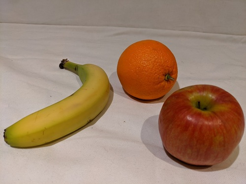
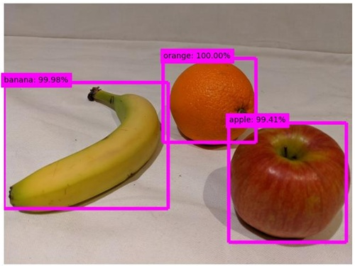

---
lab:
  title: Detección de objetos en imágenes
  description: "Use el servicio Custom\_Vision de Azure AI para entrenar un modelo de detección de objetos."
---

# Detección de objetos en imágenes

El servicio **Custom Vision de Azure AI** le permite crear modelos de visión del equipo que están entrenados con sus propias imágenes. Puede usarlo para entrenar modelos de *clasificación de imágenes* y *detección de objetos*, que más tarde puede publicar y consumir desde las aplicaciones.

En este ejercicio, usará el servicio Custom Vision para entrenar un modelo de *detección de objetos* que pueda detectar y localizar tres tipos de fruta (manzana, plátano y naranja) en una imagen.

Aunque este ejercicio se basa en el SDK de Python de Azure Custom Vision, puede desarrollar aplicaciones similares usando varios SDK específicos del lenguaje, como:

* [Azure Custom Vision para JavaScript (entrenamiento)](https://www.npmjs.com/package/@azure/cognitiveservices-customvision-training)
* [Azure Custom Vision para JavaScript (predicción)](https://www.npmjs.com/package/@azure/cognitiveservices-customvision-prediction)
* [Azure Custom Vision para Microsoft .NET (entrenamiento)](https://www.nuget.org/packages/Microsoft.Azure.CognitiveServices.Vision.CustomVision.Training/)
* [Azure Custom Vision para Microsoft .NET (predicción)](https://www.nuget.org/packages/Microsoft.Azure.CognitiveServices.Vision.CustomVision.Prediction/)
* [Azure Custom Vision para Java (entrenamiento)](https://search.maven.org/artifact/com.azure/azure-cognitiveservices-customvision-training/1.1.0-preview.2/jar)
* [Azure Custom Vision para Java (predicción)](https://search.maven.org/artifact/com.azure/azure-cognitiveservices-customvision-prediction/1.1.0-preview.2/jar)

Este ejercicio dura aproximadamente **45** minutos.

## Creación de recursos de Custom Vision

Antes de poder entrenar un modelo, necesitará recursos de Azure para el *entrenamiento* y la *predicción*. Puede crear recursos de **Custom Vision** para cada una de estas tareas, o puede crear un único recurso y usarlo en ambas. En este ejercicio, creará recursos de **Custom Vision** para entrenamiento y predicción.

1. Abra [Azure Portal](https://portal.azure.com) en `https://portal.azure.com`, e inicie sesión con sus credenciales de Azure. Cierre los mensajes de bienvenida o sugerencias que se muestran.
1. Seleccione **Crear un recurso**.
1. En la barra de búsqueda, busque `Custom Vision`, seleccione **Custom Vision** y cree el recurso con la siguiente configuración:
    - **Opciones de creación**: ambas
    - **Suscripción**: *suscripción a Azure*
    - **Grupo de recursos**: *crea o selecciona un grupo de recursos*
    - **Región**: *elige cualquier región disponible*
    - **Nombre**: *un nombre válido para el recurso de Custom Vision*.
    - **Plan de tarifa de entrenamiento**: F0
    - **Plan de tarifa de predicción**: F0

1. Cree el recurso y espere a que se finalice la implementación; a continuación, vea los detalles de la implementación. Tenga en cuenta que se aprovisionan dos recursos de Custom Vision; uno para entrenamiento y otro para predicción.

    > **Nota**: Cada recurso tiene su propio *punto de conexión* y sus *claves*, que se usan para administrar el acceso desde el código. Para entrenar un modelo de clasificación de imágenes, el código debe usar el recurso de *entrenamiento* (con su punto de conexión y su clave); y para usar el modelo entrenado para predecir clases de imágenes, el código debe usar el recurso de *predicción* (con su punto de conexión y su clave).

1. Cuando se hayan implementado los recursos, vaya al grupo de recursos para verlos. Debería ver dos recursos de Custom Vision, uno con el sufijo ***-Prediction***.

## Creación de un proyecto de Custom Vision en el portal de Custom Vision

Para entrenar un modelo de detección de objetos, debe crear un proyecto de Custom Vision basado en el recurso de entrenamiento. Para hacerlo, debe usar el portal de Custom Vision.

1. Abra una nueva pestaña del explorador (manteniendo abierta la pestaña de Azure Portal; volverá a ella más adelante).
1. En la nueva pestaña del explorador, abra el [portal de Custom Vision](https://customvision.ai) en `https://customvision.ai`. Si se le solicita, inicie sesión con sus credenciales de Azure y acepte los términos de servicio.
1. Cree un proyecto con la siguiente configuración:
    - **Nombre**: `Detect Fruit`
    - **Descripción**: `Object detection for fruit.`
    - **Recurso**: *su recurso de Custom Vision*.
    - **Tipos de proyecto**: detección de objetos
    - **Dominios**: General
1. Espere a que el proyecto se cree y abra en el explorador.

## Carga y etiquetado de imágenes

Ahora que tiene un proyecto de detección de objetos, puede cargar y etiquetar imágenes para entrenar un modelo.

### Carga y etiquetado de imágenes en el portal de Custom Vision

El portal de Custom Vision incluye herramientas visuales que puede usar para cargar imágenes y etiquetar regiones dentro de ellas que contienen varios tipos de objeto.

1. En una nueva pestaña del explorador, descargue las [imágenes de entrenamiento](https://github.com/MicrosoftLearning/mslearn-ai-vision/raw/main/Labfiles/object-detection/training-images.zip) de `https://github.com/MicrosoftLearning/mslearn-ai-vision/raw/main/Labfiles/object-detection/training-images.zip` y extraiga la carpeta comprimida para ver su contenido. Esta carpeta contiene imágenes de fruta.
1. En el portal de Custom Vision, en el proyecto de detección de objetos, seleccione **Add images** y cargue todas las imágenes de la carpeta extraída.
1. Una vez cargadas las imágenes, seleccione la primera para abrirla.
1. Mantenga presionado el mouse sobre cualquier objeto de la imagen hasta que se muestre una región detectada automáticamente como la imagen siguiente. A continuación, seleccione el objeto y, si es necesario, cambie el tamaño de la región para rodearlo.

    

    Como alternativa, simplemente puede arrastrar alrededor del objeto para crear una región.

1. Cuando la región rodea el objeto, agregue una nueva etiqueta con el tipo de objeto adecuado (*manzana*, *plátano* o *naranja*) como se muestra aquí:

    

1. Seleccione y etiquete el objeto de las otras en la imagen, cambiando el tamaño de las regiones y agregando nuevas etiquetas según sea necesario.

    

1. Use el vínculo **>** de la derecha para pasar a la siguiente imagen y etiquetar sus objetos. A continuación, siga trabajando en toda la colección de imágenes, etiquetando cada manzana, plátano y naranja.

1. Cuando hayas terminado de etiquetar la última imagen, cierra el editor **Detalles de la imagen**. En la página **Imágenes de entrenamiento**, en **Etiquetas**, selecciona **Etiquetado** para ver todas tus imágenes etiquetadas:


### Uso del SDK de Custom Vision para cargar imágenes

Puedes usar la interfaz de usuario en el portal de Custom Vision para etiquetar las imágenes, pero muchos equipos de desarrollo de IA usan otras herramientas que generan archivos con información sobre regiones de objetos y etiquetas de imágenes. En escenarios como este, puede usar la API de entrenamiento de Custom Vision para cargar imágenes etiquetadas en el proyecto.

1. Haga clic en el icono de *configuración* (&#9881;) situado en la parte superior derecha de la página **Imágenes de entrenamiento** del portal de Custom Vision para ver la configuración del proyecto.
1. En **General** (a la izquierda), fíjese en el **Id. de proyecto** que identifica de forma única este proyecto.
1. A la derecha, en **Recursos**, observe que se muestran la **clave** y el **punto de conexión**. Estos son los detalles del recurso de *entrenamiento*. También puede obtener esta información viendo el recurso en Azure Portal.
1. Vuelva a la pestaña del explorador que contiene Azure Portal (manteniendo abierta la pestaña del portal de Custom Vision; volverá a ella más adelante).
1. En Azure Portal, use el botón **[\>_]** situado a la derecha de la barra de búsqueda en la parte superior de la página para crear una nueva instancia de Cloud Shell en Azure Portal, y seleccione un entorno de ***PowerShell*** sin almacenamiento en su suscripción.

    Cloud Shell proporciona una interfaz de la línea de comandos en un panel situado en la parte inferior de Azure Portal.

    > **Nota**: si has creado anteriormente una instancia de Cloud Shell que usa un entorno de *Bash*, cámbiala a ***PowerShell***.

    > **Nota**: Si el portal le pide que seleccione un almacenamiento para conservar los archivos, elija **No se requiere una cuenta de almacenamiento**, seleccione la suscripción que usa y presione **Aplicar**.

1. En la barra de herramientas de Cloud Shell, en el menú **Configuración**, selecciona **Ir a la versión clásica** (esto es necesario para usar el editor de código).

    **<font color="red">Asegúrate de que has cambiado a la versión clásica de Cloud Shell antes de continuar.</font>**

1. Cambie el tamaño del panel de Cloud Shell para que pueda ver una mayor superficie.

    > **Sugerencia**: Puede cambiar el tamaño del panel arrastrando el borde superior. También puede usar los botones de minimizar y maximizar para cambiar entre Cloud Shell y la interfaz principal del portal.

1. En el panel de Cloud Shell, escribe los siguientes comandos para clonar el repositorio de GitHub que contiene los archivos de código de este ejercicio (escribe el comando o cópialo en el Portapapeles y, a continuación, haz clic con el botón derecho en la línea de comandos y pega como texto sin formato):

    ```
    rm -r mslearn-ai-vision -f
    git clone https://github.com/MicrosoftLearning/mslearn-ai-vision
    ```

    > **Sugerencia**: al pegar comandos en CloudShell, la salida puede ocupar una gran cantidad del búfer de pantalla. Puedes despejar la pantalla al escribir el comando `cls` para que te resulte más fácil centrarte en cada tarea.

1. Una vez clonado el repositorio, use el siguiente comando para ir a los archivos de código de la aplicación:

    ```
   cd mslearn-ai-vision/Labfiles/object-detection/python/train-detector
   ls -a -l
    ```

    La carpeta contiene archivos de código y configuración de aplicaciones para la aplicación. También contiene un archivo **tagged-images.json** con coordenadas de rectángulo de selección para objetos de varias imágenes y una subcarpeta **/images**, que contiene las imágenes.

1. Instale el paquete del SDK de Custom Vision de Azure AI para entrenamiento y cualquier otro paquete necesario ejecutando los siguientes comandos:

    ```
   python -m venv labenv
   ./labenv/bin/Activate.ps1
   pip install -r requirements.txt azure-cognitiveservices-vision-customvision
    ```

1. Escriba el siguiente comando para editar el archivo de configuración de la aplicación:

    ```
   code .env
    ```

    El archivo se abre en un editor de código.

1. En el archivo de código, actualice los valores de configuración que contiene para reflejar el **punto de conexión** y una **clave** de autenticación para el recurso de *entrenamiento* de Custom Vision y el **id. de proyecto** del proyecto de Custom Vision que creó anteriormente.
1. Después de reemplazar los marcadores de posición, usa el comando **CTRL+S** para guardar los cambios y, después, usa el comando **CTRL+Q** para cerrar el editor de código mientras mantienes abierta la línea de comandos de Cloud Shell.
1. En la línea de comandos de Cloud Shell, escriba el siguiente comando para abrir el archivo **tagged-images.json** para ver la información de etiquetado de los archivos de imagen de la subcarpeta **/images**:

    ```
   code tagged-images.json
    ```
    
     El código JSON define una lista de imágenes, que contiene cada una una o varias regiones etiquetadas. Cada región etiquetada incluye un nombre de etiqueta y las coordenadas superior e izquierda y las dimensiones de ancho y altura del cuadro de límite que contiene el objeto etiquetado.

    > **Nota**: Las coordenadas y dimensiones de este archivo indican puntos relativos en la imagen. Por ejemplo, un valor de *altura* de 0,7 hace referencia a un cuadro que es el 70 % del alto de la imagen. Algunas herramientas de etiquetado generan otros formatos de archivo en los que los valores de coordenadas y dimensiones representan píxeles, pulgadas u otras unidades de medida.

1. Cierre el archivo JSON sin guardar los cambios (*CTRL_Q*).

1. En la línea de comandos de Cloud Shell, escriba el siguiente comando para abrir el archivo de código de la aplicación cliente:

    ```
   code add-tagged-images.py
    ```

1. Observe los detalles siguientes del archivo de código:
    - Se importan los espacios de nombres del SDK de Custom Vision de Azure AI.
    - La función **Main** recupera los valores de configuración y usa la clave y el punto de conexión para crear una clase **CustomVisionTrainingClient** autenticada, que luego se usa con el id. del proyecto para crear una referencia de **proyecto** al proyecto.
    - La función **Upload_Images** extrae la información de la región etiquetada del archivo JSON y la usa para crear un lote de imágenes con regiones, que luego carga en el proyecto.

1. Cierre el editor de código (*CTRL+Q*) y escriba el siguiente comando para ejecutar el programa:

    ```
   python add-tagged-images.py
    ```

1. Espere a que el programa finalice.
1. Vuelva a la pestaña del explorador que contiene el portal de Custom Vision (manteniendo abierta la pestaña Cloud Shell de Azure Portal) y vea la página **Imágenes de entrenamiento** del proyecto (actualizando el explorador si es necesario).
1. Compruebe que se han agregado al proyecto algunas imágenes etiquetadas nuevas.

## Entrenar y probar un modelo

Ahora que ha etiquetado las imágenes del proyecto, está listo para entrenar un modelo.

1. En el proyecto de Custom Vision, haga clic en **Entrenar** (&#9881;<sub>&#9881;</sub>) para entrenar un modelo de detección de objetos usando imágenes etiquetadas. Seleccione la opción **Entrenamiento rápido**.
1. Espere a que se complete el entrenamiento (puede tardar diez minutos o así).

    > **Sugerencia**: Azure Cloud Shell tiene un tiempo de espera de inactividad de 20 minutos, después del cual se abandona la sesión. Mientras espera a que finalice el entrenamiento, vuelva a Cloud Shell de forma ocasional y escriba un comando como `ls` para mantener la sesión activa.

1. En el portal de Custom Vision, cuando haya finalizado el entrenamiento, revise las métricas de rendimiento *Precision*, *Coincidencia* y *mAP*, que miden la precisión en la predicción del modelo de detección de objetos y deben ser altas.
1. En la parte superior derecha de la página, haga clic en **Prueba rápida** y, a continuación, en el cuadro **Dirección URL de la imagen**, escriba `https://aka.ms/test-fruit` y haga clic en el botón *imagen de prueba rápida* (&#10132;).
1. Vea la predicción que se genera.

    

1. Cierre la ventana **Quick Test**.

## Uso del detector de objetos en una aplicación cliente

Ahora está listo para publicar el modelo entrenado y usarlo en una aplicación cliente.

### Publicación del modelo de detección de objetos

1. En el portal de Custom Vision, en la página **Rendimiento**, haga clic en **&#128504; Publicar** para publicar el modelo entrenado con la siguiente configuración:
    - **Nombre del modelo**: `fruit-detector`
    - **Recurso de predicción**: *el recurso de **predicción** creado anteriormente que termina en -Prediction (<u>no</u> el recurso de entrenamiento)*.
1. En la parte superior izquierda de la página **Configuración del proyecto**, haga clic en el icono *Projects Gallery* (Galería de proyectos) (&#128065;) para volver a la página principal del portal de Custom Vision, donde debería aparecer su proyecto.
1. En la página principal del portal de Custom Vision, en la esquina superior derecha, haga clic en el icono de *configuración* (&#9881;) para ver la configuración de su servicio Custom Vision. A continuación, en **Recursos**, busque el recurso de *predicción* que termina en -Prediction (<u>no</u> el recurso de entrenamiento) para determinar sus valores de **Clave** y **Punto de conexión**. También puede consultar el recurso en Azure Portal para obtener esta información.

## Uso del clasificador de imágenes desde una aplicación cliente

Ahora que ha publicado el modelo de clasificación de imágenes, puede usarlo desde una aplicación cliente. Una vez más, puede optar por usar **C#** o **Python**.

1. Vuelva a la pestaña del explorador que contiene Azure Portal y el panel de Cloud Shell.
1. En Cloud Shell, ejecute los siguientes comandos para cambiar a la carpeta de la aplicación cliente y ver los archivos que contiene:

    ```
   cd ../test-detector
   ls -a -l
    ```

    La carpeta contiene archivos de código y configuración de aplicaciones para la aplicación. También contiene el siguiente archivo de imagen **produce.jpg**, que usará para probar el modelo.

    

1. Instale el paquete del SDK de Custom Vision de Azure AI para la predicción y cualquier otro paquete necesario ejecutando los siguientes comandos:

    ```
   python -m venv labenv
   ./labenv/bin/Activate.ps1
   pip install -r requirements.txt azure-cognitiveservices-vision-customvision
    ```

1. Escriba el siguiente comando para editar el archivo de configuración de la aplicación:

    ```
   code .env
    ```

    El archivo se abre en un editor de código.

1. Actualice los valores de configuración para reflejar el **punto de conexión** y la **clave** del recurso de *predicción<u> de </u>Custom Vision*, el **id. de proyecto** del proyecto de detección de objetos y el nombre del modelo publicado (que debe ser *fruit-detector*). Guarde los cambios (*CTRL+S*) y cierre el editor de código (*CTRL+Q*).

1. En la línea de comandos de Cloud Shell, escriba el siguiente comando para abrir el archivo de código de la aplicación cliente:

    ```
   code test-detector.py
    ```

1. Revise el código y observe los detalles siguientes:
    - Se importan los espacios de nombres del SDK de Custom Vision de Azure AI.
    - La función **Main** recupera los valores de configuración y usa la clave y el punto de conexión para crear una clase **CustomVisionPredictionClient** autenticada.
    - El objeto de cliente de predicción se usa para obtener predicciones de detección de objetos de la imagen **produce.jpg**; para ello, se debe especificar el id. del proyecto y el nombre del modelo en la solicitud. A continuación, las regiones etiquetadas que se han predicho se dibujan en la imagen y el resultado se guarda como **output.jpg**.
1. Cierre el editor de código y escriba el siguiente comando para ejecutar el programa:

    ```
   python test-detector.py
    ```

1. Revise la salida del programa, que enumera cada objeto detectado en la imagen.
1. Observe que se genera un archivo de imagen denominado **output.jpg**. Use el comando **download** (específico de Azure Cloud Shell) para descargarlo:

    ```
   download output.jpg
    ```

    El comando download crea un vínculo emergente en la parte inferior derecha del explorador, que puedes seleccionar para descargar y abrir el archivo. La imagen debe tener un aspecto similar al siguiente:

    

## Limpieza de recursos

Si no usas los recursos de Azure creados en este laboratorio para otros módulos de entrenamiento, puedes eliminarlos para evitar incurrir en cargos adicionales.

1. Abre Azure Portal en `https://portal.azure.com` y, en la barra de búsqueda superior, busca los recursos que creaste en este laboratorio.

1. En la página del recurso, selecciona **Eliminar** y sigue las instrucciones para eliminar el recurso. Una alternativa es eliminar todo el grupo de recursos para limpiar todos los recursos al mismo tiempo.
   
## Más información

Para obtener más información sobre la detección de objetos con el servicio Custom Vision, consulte la [documentación de Custom Vision](https://docs.microsoft.com/azure/cognitive-services/custom-vision-service/).
